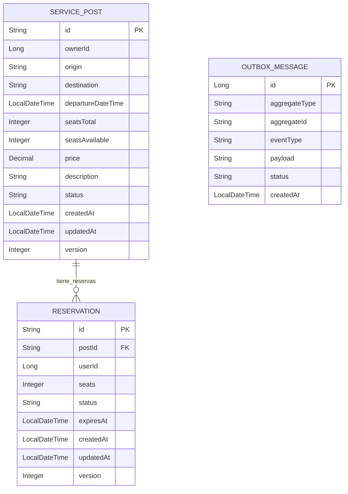

# Transport Booking Service — Sistema de Reserva de Transporte Compartido

## 📝 ¿Qué es este proyecto?

**Transport Booking Service** es un microservicio para la gestión de reservas de transporte compartido (carpooling), diseñado para entornos de alta concurrencia y consistencia eventual.

Permite a los conductores publicar viajes disponibles y a los pasajeros reservar asientos en tiempo real, optimizando la disponibilidad y la resiliencia ante fallos mediante patrones modernos como Outbox, Kafka, optimistic locking y métricas Prometheus.

**Arquitectura**: Este proyecto implementa **Arquitectura Hexagonal** (Ports & Adapters) para mantener el dominio desacoplado de la infraestructura. Ver [documentación completa de arquitectura](docs/HEXAGONAL_ARCHITECTURE.md).

---

## 📚 Índice

1. [Resumen](#resumen)
2. [Arquitectura](#arquitectura)
3. [Stack Técnico](#stack-técnico)
4. [Cómo Ejecutar](#-cómo-ejecutar-localmente)
5. [API y Ejemplos](#api-documentation)
6. [Monitoreo y Métricas](#monitoreo)
7. [Decisiones y Trade-offs](#trade-offs-y-decisiones)
8. [Limitaciones y Roadmap](#limitaciones-y-próximos-pasos)
9. [Diagramas](#diagramas-de-arquitectura)
10. [Pruebas](#pruebas)

---

## 📌 Resumen

Este proyecto es un prototipo de un **sistema distribuido de gestión de reservas de transporte compartido** desarrollado en **Java 17 / Spring Boot** con arquitectura hexagonal.

### Características principales:

- **Arquitectura Hexagonal**: Separación clara entre dominio, aplicación e infraestructura
- **Publicación de viajes**: Los conductores publican servicios con origen, destino, horario y plazas disponibles
- **Reserva de asientos**: Los pasajeros reservan plazas con gestión de concurrencia mediante optimistic locking
- **Consistencia eventual**: Patrón Outbox + Kafka + idempotencia
- **Expiración automática**: Las reservas pendientes se liberan automáticamente tras un TTL configurable (15 min por defecto)
- **Observabilidad**: Métricas con Micrometer, Prometheus y Grafana
- **Seguridad básica**: Endpoints protegidos con Spring Security y JWT

---

## 🏗️ Arquitectura

Este proyecto sigue los principios de **Arquitectura Hexagonal** con tres capas claramente definidas:

### 📦 Capas

1. **Domain (Núcleo)**: Lógica de negocio pura, sin dependencias externas

   - Modelos: `ServicePost`, `Reservation`, `OutboxMessage`, `ProcessedMessage`
   - Puertos: Interfaces que definen contratos (`BookingPort`, `ServicePostPort`, `ReservationPort`)

2. **Application (Orquestación)**: Casos de uso que coordinan el dominio

   - `BookingUseCase`: Gestión de reservas y publicaciones
   - DTOs de aplicación (Commands)

3. **Infrastructure (Adaptadores)**: Implementaciones técnicas
   - REST Controllers (`PostController`, `ReservationController`)
   - Adaptadores JPA (`ServicePostAdapter`, `ReservationAdapter`)
   - Publicador Kafka
   - Métricas

**Ver documentación detallada**: [docs/HEXAGONAL_ARCHITECTURE.md](docs/HEXAGONAL_ARCHITECTURE.md)

---

## ⚙️ Stack Técnico

- **Java 17 / Spring Boot 3**
- **H2 Database** (memoria) + JPA
- **Kafka + Zookeeper** (mensajería)
- **Prometheus + Grafana + Alertmanager** (monitoring)
- **JUnit 5 + Mockito** (tests)
- **Docker Compose** para orquestación
- **SpringDoc OpenAPI** (Swagger UI)

---

## 🚀 Cómo ejecutar localmente

### 1. Construcción del backend

```bash
# Compilar el proyecto
mvn clean package -DskipTests

# Verificar la construcción
java -jar target/inventory-service-0.0.1-SNAPSHOT.jar --version
```

### 2. Iniciar Infraestructura

```bash
# Iniciar todos los servicios (Kafka + Monitoreo)
docker-compose -f docker-compose.yml -f docs/docker-compose-monitoring.yml up -d

# Verificar que todos los servicios están corriendo
docker-compose ps
```

Servicios disponibles:

- Kafka: localhost:9092
- Prometheus: http://localhost:9090
- Grafana: http://localhost:3000 (admin/admin)
- AlertManager: http://localhost:9093

### 3. Iniciar la Aplicación

```bash
./mvnw spring-boot:run
```

### 4. Verificar acceso

Una vez que la aplicación esté corriendo:

1. **Health Check**: http://localhost:8080/actuator/health
2. **Swagger UI**: http://localhost:8080/swagger-ui.html
3. **OpenAPI Docs**: http://localhost:8080/v3/api-docs

---

## API Documentation

La documentación OpenAPI está disponible en:

- **Swagger UI**: http://localhost:8080/swagger-ui.html
- **OpenAPI JSON**: http://localhost:8080/v3/api-docs

### Endpoints Principales

#### Service Posts (Publicaciones de Viajes)

- `POST /api/v1/posts` - Crear nueva publicación
- `POST /api/v1/posts/{id}/publish` - Publicar servicio
- `GET /api/v1/posts` - Listar publicaciones disponibles
- `GET /api/v1/posts/{id}` - Ver detalle de publicación
- `GET /api/v1/posts/search` - Buscar por ruta y fecha

#### Reservations (Reservas)

- `POST /api/v1/posts/{postId}/reserve` - Crear reserva
- `PUT /api/v1/reservations/{id}/confirm` - Confirmar reserva
- `PUT /api/v1/reservations/{id}/cancel` - Cancelar reserva
- `GET /api/v1/reservations/{id}` - Ver detalle de reserva
- `GET /api/v1/users/{userId}/reservations` - Historial de reservas de usuario
- `GET /api/v1/posts/{postId}/reservations` - Reservas de una publicación

### Ejemplos de Uso

#### Crear Publicación de Viaje

```bash
curl --location 'http://localhost:8080/api/v1/posts' \
--header 'Content-Type: application/json' \
--data '{
  "ownerId": 1,
  "origin": "Zipaquirá",
  "destination": "Bogotá",
  "departureDateTime": "2025-11-15T08:00:00",
  "seatsTotal": 4,
  "price": 15000.00,
  "description": "Viaje directo por autopista Norte"
}'
```

#### Reservar Asientos

```bash
curl --location 'http://localhost:8080/api/v1/posts/post-001/reserve' \
--header 'Content-Type: application/json' \
--data '{
  "userId": 10,
  "seats": 2
}'
```

#### Confirmar Reserva

```bash
curl --location --request PUT 'http://localhost:8080/api/v1/reservations/res-001/confirm'
```

#### Buscar Viajes

```bash
curl --location 'http://localhost:8080/api/v1/posts/search?origin=Zipaquirá&destination=Bogotá'
```

Ver más ejemplos en: [docs/transport-sample-requests.http](docs/transport-sample-requests.http)

---

## 🛠️ ¿Qué hace el servicio?

- **Publicación de viajes**: Los conductores crean y publican servicios de transporte con capacidad de asientos
- **Reserva de asientos**: Los pasajeros reservan plazas disponibles con validación de stock en tiempo real
- **Gestión de estado**: Confirmación, cancelación y expiración automática de reservas
- **Consistencia eventual**: Los cambios se publican como eventos en Kafka usando el patrón Outbox
- **Optimistic Locking**: Evita sobreventa mediante versionado optimista de entidades
- **Métricas y monitoreo**: Expone métricas clave para observabilidad

---

## 📊 Monitoreo

### Métricas Disponibles

- `reservations_created_total`: Total de reservas creadas
- `reservation_conflicts_total`: Total de conflictos por falta de cupo
- `reservation_duration_seconds`: Duración de operaciones de reserva
- `outbox_pending_count`: Mensajes pendientes en outbox

### Logs Importantes

```log
2024-01-24 12:34:56 INFO  Created service post id=xxx, route: Zipaquirá -> Bogotá
2024-01-24 12:34:57 INFO  Reservation created successfully: xxx
2024-01-24 12:34:58 WARN  Insufficient seats for reservation
```

---

## 💡 Trade-offs y Decisiones

1. **Consistencia Eventual vs Fuerte**:
   Consistencia eventual mediante patrón Outbox.
   Beneficio: mejor disponibilidad y escalabilidad.
   Costo: ventana de inconsistencia temporal.

2. **Optimistic Locking**:
   Versioning optimista en lugar de locks pesimistas.
   Beneficio: mejor concurrencia y throughput.
   Costo: retries ocasionales en alta concurrencia.

3. **Expiración de Reservas**:
   TTL de 15 minutos para reservas pendientes.
   Beneficio: libera automáticamente asientos no confirmados.
   Trade-off: requiere job periódico.

4. **In-Memory Database**:
   H2 para prototipado rápido.
   Trade-off: simplicidad vs durabilidad.

---

## 🚧 Limitaciones y Próximos Pasos

### Limitaciones Actuales

- Sin persistencia durable (H2 in-memory)
- Expiración de reservas manual (requiere job scheduler)
- Sin notificaciones en tiempo real (WebSocket)
- Sin integración con sistema de pagos

### Roadmap

1. Migrar a PostgreSQL
2. Implementar scheduler para expiración automática
3. Añadir WebSocket para notificaciones real-time
4. Circuit breakers y rate limiting
5. Logging estructurado (JSON)
6. Integración con gateway de pagos
7. App móvil (Flutter)

---

## 📐 Diagramas de Arquitectura

### Modelo de Datos (MER)



---

## 🧪 Pruebas

### Ejecutar Tests

```bash
# Ejecutar todas las pruebas
./mvnw test

# Ejecutar pruebas específicas
./mvnw test -Dtest=BookingUseCaseTest

# Ejecutar pruebas de concurrencia
./mvnw test -Dtest=BookingUseCaseConcurrencyIT

# Generar reporte de cobertura
./mvnw test jacoco:report
```

### Tipos de Pruebas

- **Unitarias**: Casos de uso aislados, mocks de dependencias
- **Integración**: Flujos completos, base de datos en memoria
- **Concurrencia**: Validación de optimistic locking y manejo de conflictos
- **API**: Endpoints REST, validación de requests/responses

---

## 📦 Repositorio

El código está disponible públicamente en GitHub:
https://github.com/o0410acut-spec/MELI

```bash
git clone https://github.com/o0410acut-spec/MELI.git
cd MELI
```

---

## 🛠️ Comandos Útiles

### Docker Compose

```bash
# Iniciar servicios
docker-compose -f docker-compose.yml -f docs/docker-compose-monitoring.yml up -d

# Ver logs
docker-compose logs -f

# Detener servicios
docker-compose down
```

### Maven

```bash
# Compilar
mvn clean package

# Ejecutar aplicación
mvn spring-boot:run

# Ejecutar tests
mvn test

# Ver reporte de cobertura
mvn jacoco:report
open target/site/jacoco/index.html
```

---

## 📝 Licencia

Este proyecto es un ejemplo educativo para demostrar arquitectura hexagonal y patrones de sistemas distribuidos.

---

## 👤 Autor

Desarrollado como proyecto de demostración técnica.

---

**Happy Coding! 🚗💨**
